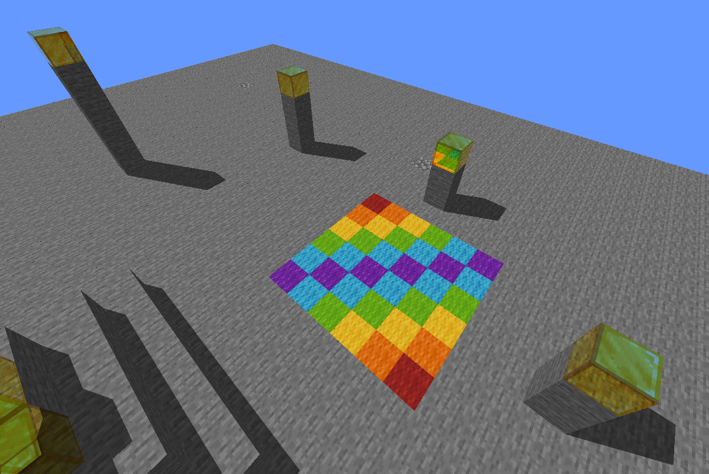
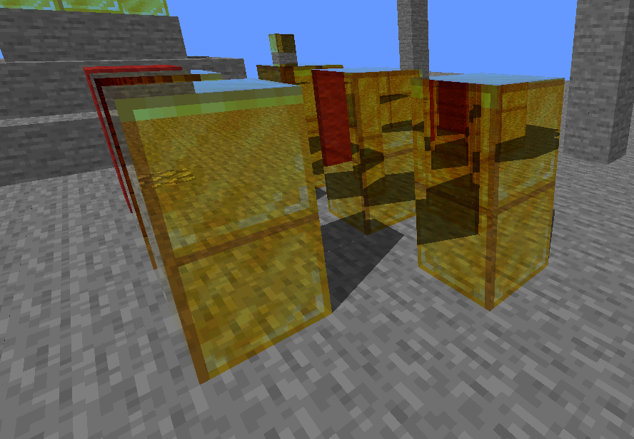
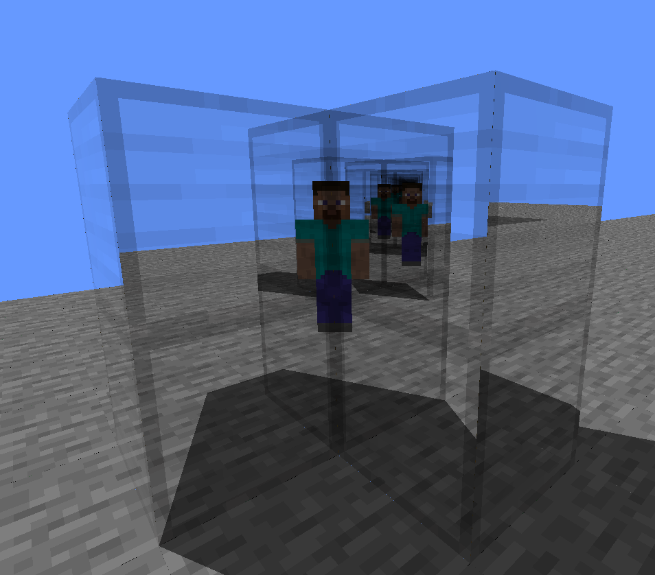

# ❗ <ins>Before you try it out, read this!</ins> ❗

This shader is WIP, therefore it lacks many features, including complete support for some of the blocks and all entities. If you want to try it out (although it's not necessary), play in a void or superflat world. Regardless of what you use, set the following game rules:

```
doMobSpawning false
doTileDrops false
```
After this, do `/kill @e[type=!player]` twice to make sure nothing's left.

(You'll want to avoid any lava. If you see random blocks or full layers popping into existence and back, it's either lava or entities)

# Vanilla pudding tart 

Path tracing shader for vanilla Minecraft 1.17+

## Features

- Path traced global illumination
- Shadows
- Reflections
- Emission (= light sources work as they should)
- Configurable F0, metallicity and roughness factors
- Atmospheric effects

## How to install

Unless you know exactly what you are doing, install it through [Tart Tin](https://github.com/BalintCsala/TartTin)

## Pro mode

> Only do this if you know what you are doing. Good rule of thumb: If you don't know if you'll know what you will be doing, you won't.

A couple of values can be configured in `assets/minecraft/shaders/program/raytracer.fsh` for a better effect. Each of these has a huge impact on performance, so make sure you don't burn out your graphcs card. It's generally not a good idea to increase the first three to more than 2x their original value (so `MAX_GLOBAL_ILLUMINATION_BOUNCES` shouldn't go above 6)

A description of each of these values is included in the following code block:

```glsl
// This determines how many steps (approx. blocks) the GI ray will go through to check bounce lighting (complexity: O(N))
const int MAX_GLOBAL_ILLUMINATION_STEPS = 10;
// This will determine how many bounces a GI ray is allowed to do to calculate the light level at a pixel (complexity: O(N^2))
const int MAX_GLOBAL_ILLUMINATION_BOUNCES = 3;
// This will determine the amount of reflection bounces a ray will do, if you increase it, mirror rooms will be better (complexity: O(N^3))
const int MAX_REFLECTION_BOUNCES = 10;
// The color of the sun multiplied by intensity
const vec3 SUN_COLOR = 1.0 * vec3(1.0, 0.95, 0.8);
// The color of the sky multiplied by intensity. This also affects ambient lighting
const vec3 SKY_COLOR = 1 * vec3(0.2, 0.35, 0.5);
// The maximum strength of emissive materials, larger values will result in coarser individual steps, but larger maximums
const float MAX_EMISSION_STRENGTH = 5;
```

## Examples

These images were taken without any noise reduction. Looks less noisy in-game.



(oCd PBR was used for this image)
