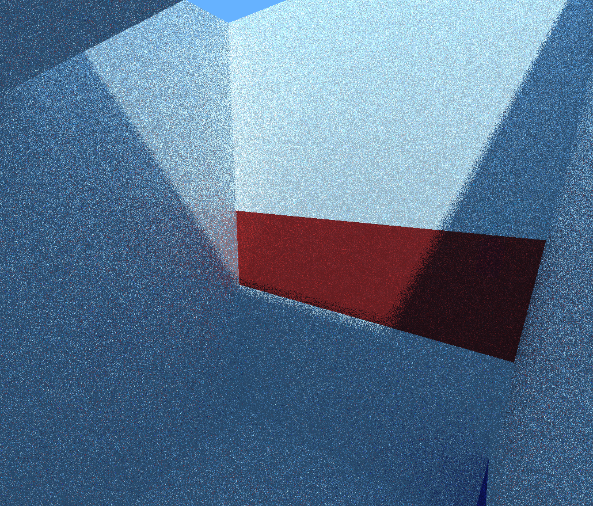
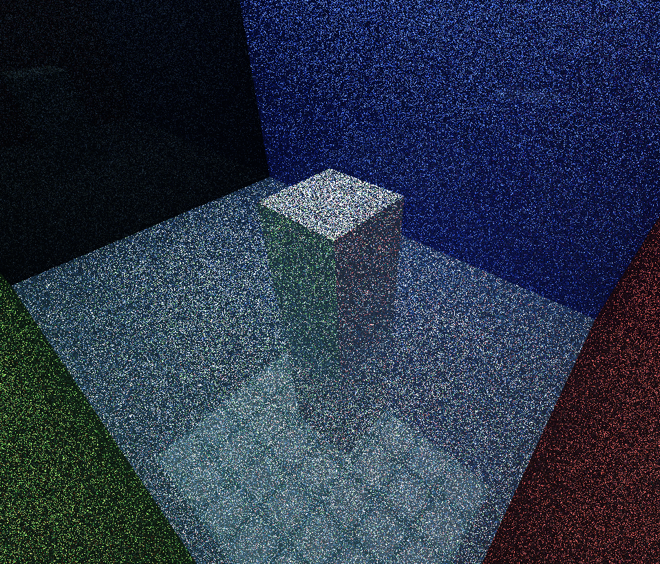

# ❗ <ins>Before you try it out, read this!</ins> ❗

**Slight epilepsy warning**, the shader generates a lot of noise (this is by design, imagine a very colorful TV static). Don't try it out if you are prone to seizures. This will be remedied in a future patch. (This has been solved somewhat, still not ideal, but much less static-like)

This shader is WIP, therefore it lacks many features, including complete support for some of the blocks. ~~If you still want to try it out, do it in a void world~~ It's not required to play in a void world anymore, but it's still recommended, since entities break it easily.

# Path tracing 1.17 shader

## Notes on the latest version

I'm currently implementing more blocks into the shader. I replaced the in-game atlas with a custom one (vanilla textures still). Most blocks _work_, but not completely (All blocks are cube-shaped and most of them have the same textures on all sides). The only exceptions are vertical column blocks (e.g. vertical logs) and grass blocks.

The texture atlas will be generated using a separate (open source) program, so custom resource packs will be supported in the future, albeit not without some small work.

Due to the change in the atlas, some features aren't used in this version (emission, reflections, roughness, etc.). They are still supported and can easily be enabled by editing the atlas manually, but no blocks do this by default. The atlas generator will be released once it has support for these options.

## Features

- Path traced global illumination
- Shadows
- Reflections
- Emission (= light sources work as they should)
- Configurable F0, metallicity and roughness factors

## How to install

Usually works on the current snapshot (at the time of writing this, it's 1.17 pre-release 1), but make sure to check the last commit date! If it doesn't work on the latest and the date is before the release date of the snapshot, then I probably haven't gotten around to updating it yet. If it works, but the textures are messed up, that means that it's the wrong snapshot.

This also only works if the resolution of your monitors exceeds or matches 1024x768 in both directions

1. Press the green `⤓ Code` button and select "Download ZIP"
2. Extract the content of the ZIP file to your resource pack folder
3. Start the game and enter into a world (a superflat with the void preset is a good starting point, as most normal worlds don't work)
4. Go into video settings and set Graphics to _Fabulous!_
5. Go into resource packs and enable the path tracing resource pack. Make sure to disable anything else, even if they don't have shaders.

## Adept mode

> It's dangerous to go alone! Take this.

The current view distance is pretty bad (44 blocks in the 3 cardinal directions). This is sadly the limit of the 1024x705 (windowed 768p) minimum resolution I chose.

I can't increase this without removing support for a bunch of people, so if you have a larger screen (which you most likely do) and want better view distance (which you also likely want), you'll need to edit the code a bit.

> Whenever I mention the resolution in the following paragraph, I mean the actual resolution the game is running at. This will only match the monitor resolution when the game is in full screen. You can find the actual resolution on the F3 debug screen in-game on the right side.

The maximum viewable area width (2 x view distance) `v` can be calculated using the following equation, where Sx and Sy are the screen width and height in pixels and `floor` gives you the integer part of a decimal (`floor(5.6) = 5`):

```
floor(Sx / v) * floor(Sy / v) >= v
```

A rough approximation can be found quickly by multiplying the width and height of the screen and taking the third root. This will be the maximum value you could reach in an ideal scenario, but the actual value will probably be less.

For instance:
A 4k screen (3840x2160) has an area of 8294400 pixels, so the theoretical max view area width is 202, but the largest value that satisfies the inequality is 196, therefore the actual value is 196.

```
floor(3840 / 196) = 19
floor(2160 / 196) = 11
11 * 19 = 209 >= 196
```

Some values for common screen resolutions (all of these are for fullscreen):

- 1366x768 (768p): 98
- 1600x900: 112 (This is a case where actual and max values match)
- 1920x1080 (1080p): 120
- 2560x1080 (ultrawide 1080p): 135
- 2560x1440 (1440p): 150
- 3840x2160 (4k): 196
- 7680x4320 (8k): 312 (Maybe the 2 fps you'll be getting at this resolution isn't worth it)

Once you have `v`, you need to edit some files. Go into the resource pack folder and find the files

- `assets/minecraft/shaders/include/utils.glsl`
- `assets/minecraft/shaders/program/raytracer.fsh`

And edit the following 2 lines in **both** files according to v (These should be near the top):

```glsl
const vec2 VOXEL_STORAGE_RESOLUTION = vec2(1024, 705);  // This should be the screen resolution you used earlier
const float LAYER_SIZE = 88;                            // This should be "v"
```

You should also edit the following line in raytracer.fsh:

```glsl
const int MAX_STEPS = 100; // Set this to roughly 2-3 times "v"
```

The shader should work at this point with the increased view distance.

## Expert mode

> If you want to edit the material properties of blocks, this is where you need to be looking.

A single atlas controls the material properties for all blocks. This can be found at `assets/minecraft/textures/effect/atlas.png`.

The texture is divided into 4 parts:

- The top left corner is the normal texture atlas (albedo if you will).
- The top right corner is emission information. Transparent is no emission, strength of a light is based on the alpha channel (you need to lay the atlas on top of this temporarily, if you want to edit it).
- The bottom left corner is F0 (amount of refraction when looking at a surface directly, essentially reflection color). Generally should be gray for non-metallic (dielectric) materials and colored for metals. Use schlick's approximation to calculate it from refractive index (`F0 = (n-1)^2 / (n + 1)^2`, where `n` is the refractive index).
- The bottom right corner is a combined metallicity (red channel) and roughness (green channel) map. In the future this will also hold other miscellaneous values if needed.

## Pro mode

> Only do this if you know what you are doing. Good rule of thumb: If you don't know if you'll know what you will be doing, you won't.

A couple of values can be configured in `assets/minecraft/shaders/program/raytracer.fsh` for a better effect. Each of these has a huge impact on performance, so make sure you don't burn out your graphcs card.

A description of each of these values is included in the following code block:

```glsl
// This determines how many steps (approx. blocks) the GI ray will go through to check bounce lighting (complexity: O(N))
const int MAX_GLOBAL_ILLUMINATION_STEPS = 10;
// This will determine how many bounces a GI ray is allowed to do to calculate the light level at a pixel (complexity: O(N^2))
const int MAX_GLOBAL_ILLUMINATION_BOUNCES = 3;
// This will determine the amount of reflection bounces a ray will do, if you increase it, mirror rooms will be better (complexity: O(N^˘3))
const int MAX_REFLECTION_BOUNCES = 10;
// The color of the sun multiplied by intensity
const vec3 SUN_COLOR = 1.0 * vec3(1.0, 0.95, 0.8);
// The color of the sky multiplied by intensity. This also affects ambient lighting
const vec3 SKY_COLOR = 1 * vec3(0.2, 0.35, 0.5);
// The maximum strength of emissive materials, larger values will result in coarser individual steps, but larger maximums
const float MAX_EMISSION_STRENGTH = 5;
```

## Examples

These images were taken without any noise reduction. Looks less noisy in-game.






